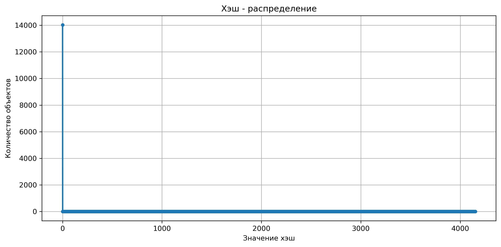
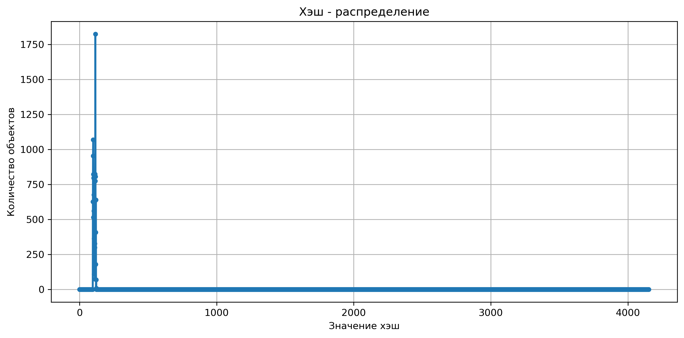
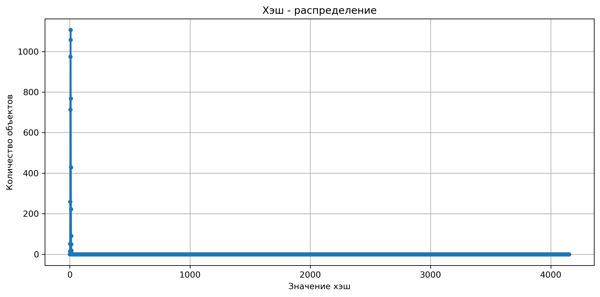
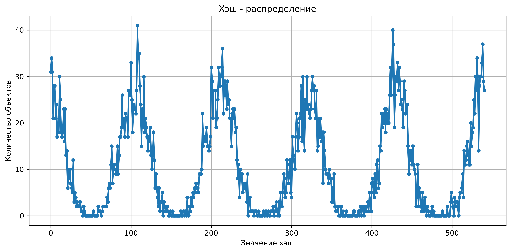
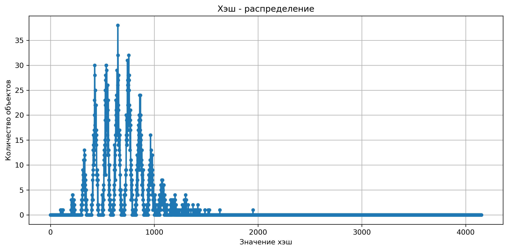
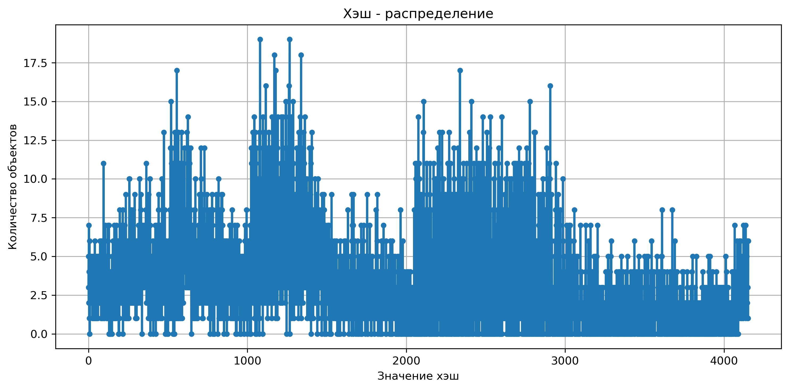
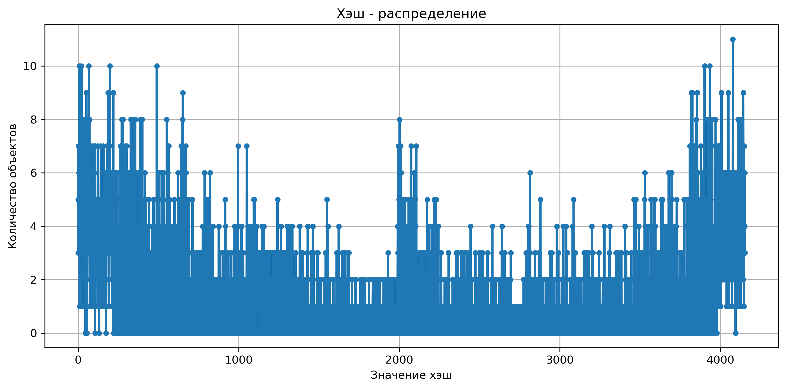
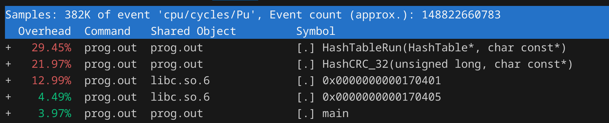

# Хэш таблица

## Различие хэш-функций:

### 0:


### Первый символ:


### Длина строки:


### Сумма символов по модулю 541:


### Сумма символов по модулю 4153:


### Циклический сдвиг влево:


### CRC32:


## Требуемость оптимизации


На данных, полученных с помощью perf наблюдаем две горячие функции: HashTableRun и HashCRC_32, они нуждаются в оптимизации. Все последующие оптимизации направлены на ускорение функции HashTableRun, так как саму Хэш функцию уже не представлется возможным оптимизировать лучше чем компилятор с опцией -O2, и попытки ускорить ее с помощью ассемблерных вставок и вынесения ассемблерной функции привели только к замедлению функции

## Уровни оптимизации:
<details>
<summary>Методика измерений</summary>

```c++
size_t start_time = __rdtsc();
for(size_t i = 0; i < CYCLES; i++)
{
    // ПРОГОН ВСЕХ СЛОВ ЧЕРЕЗ ТАБЛИЦУ
}
size_t end_time = __rdtsc();

printf("Time in ticks: %lu\n", (end_time-start_time)/10000000);
```

</details>

### Различие версий:

<details>
<summary>V0 - нативная версия</summary>

```c++
size_t hash_value = HashCRC_32(table->size, word);
List* list = &table->table[hash_value];

ListElem* elem = list->start;
while(elem)
{
    if(!strncmp(elem->word_aligned, word, MAX_WORD_LENGHT)) return elem->count;
    elem = elem->next;
}
return 0;
```

</details>

<details>
<summary>V1 - кеш-френдли список</summary>

```c++
size_t hash_value = HashCRC_32(table->size, word);
List* list = &table->table[hash_value];

ListElem* elem = list->array;
for(size_t i = 0; i < list->count; i++)
{
    if(!strncmp(elem->buffer, word, MAX_WORD_LENGHT)) return elem->count;
    elem++;
}

return 0;
```

</details>


<details>
<summary>V2 - HashTableRun на AVX инструкциях</summary>

```c++
size_t hash_value = HashCRC_32(table->size, word);

List* list = &table->table[hash_value];

__m256i* arr1 = (__m256i*)word;

ListElem* elem = list->array;
for(size_t i = 0; i < list->count; i++)
{
    __m256i* arr2 = (__m256i*)elem->buffer;

    __m256i cmp = _mm256_cmpeq_epi8(*arr1, *arr2);
    int mask = _mm256_movemask_epi8(cmp);

    if (mask == 0xFFFFFFFF) return elem->count;

    elem++;
}
return 0;
```

</details>

<details>
<summary>V3 - HashTableRun на 64-битных регистрах</summary>

```c++
size_t hash_value = HashCRC_32(table->size, word);

List* list = &table->table[hash_value];

u_int64_t* arr1 = (u_int64_t*)word;

ListElem* elem = list->array;
for(size_t i = 0; i < list->count; i++)
{
    u_int64_t* arr2 = (u_int64_t*)elem->buffer;

    bool equal = true;
    for(size_t i = 0; i < 4; i++)
    {
        if(arr1[i] != arr2[i])
        {
            equal = false;
            break;
        }
    }
    if(equal) return elem->count;

    elem++;
}

return 0;
```

</details>


### Результаты измерений:

| Параметр | v0 | v1 | v2 | v3 |
|----------|----|----|----|----|
| количество циклов поиска | 1000 | 1000 | 1000 | 1000 | 1000 | 1000 |
| количество тиков | 8897 | 7232 | 6292 | 6211 |
| ускорение относительно начальной версии | - | 18.7% | 29.3% | 30.2% |
| ускорение относительно предыдущей версии | - | 18.7% | 13.0% | 1.3% |
